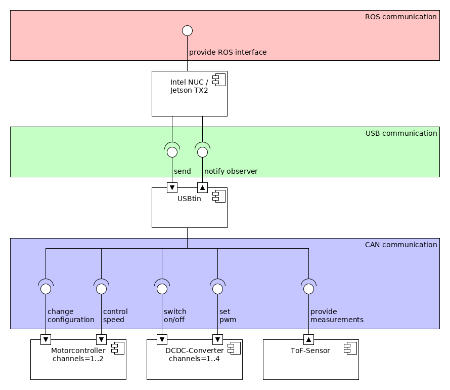
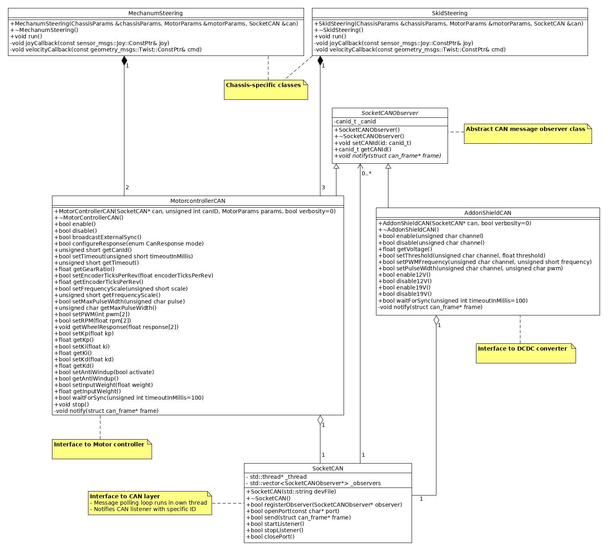

# Quick Start
For enabling CAN communication from a Linux host using the USBtin module, one needs to attach and startup the socket can interface.
Ensure, that the package can-utils is installed.
```bash
    $ sudo apt install can-utils
```
In order to get a fixed file device interface, you need to activate specific udev rules. Please copy the slcand udev file to your system folder:
```bash
    $ sudo cp drive/udev/77-evo-slcand.rules /etc/udev/rules.d/
    $ sudo udevadm control --reload-rules
```
Replug the USBtin module or reboot your computer. Then you can execute the following script:
```bash
    $ ./drive/interface/can_up.sh
```
If CAN communication is enabled, the nodes for your specific kinematics (mechanum or skid steering) can be executed.
Adjust the launch files before.

# Reference design

## Component diagram


## Class diagram

